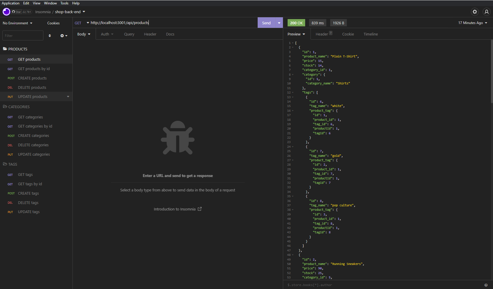

# Shop-back-end

  ## Table of Contents:
  1. [Description](#description) 
  2. [Installation](#installation)
  3. [Usage](#usage)
  5. [Test Instructions](#testInstructions)
  6. [License](#license)
  7. [Questions](#questions)
  ## Description 

  an application to add/create/remove/update products, categories and tags in an online shop. Uses mySQL, Node, insomnia. 

  ## Installation 

  log in to mysql shell, source the database, seed database with node.js, then run the server.

  ## Usage 
  

  

  here is a video  walkthrough: 
  https://youtu.be/VPs5tcUvzPo

  ## Contribution Guidelines 

  please get in contact

  ## Test Instructions 

  n/a

  ## license 

  MIT

  ## Questions 

  If you have any questions or want to get in touch you can contact me through email

  E-mail: lukerozon@gmail.com

  Github: https://www.github.com/zym0tic

